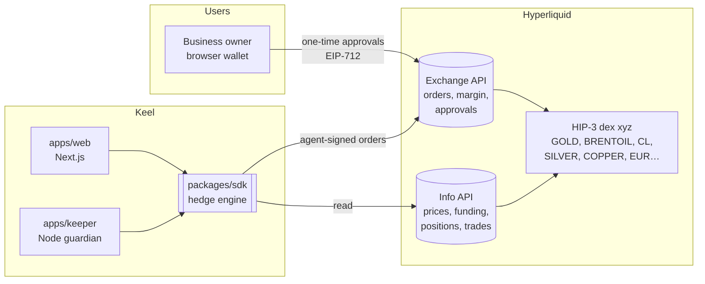
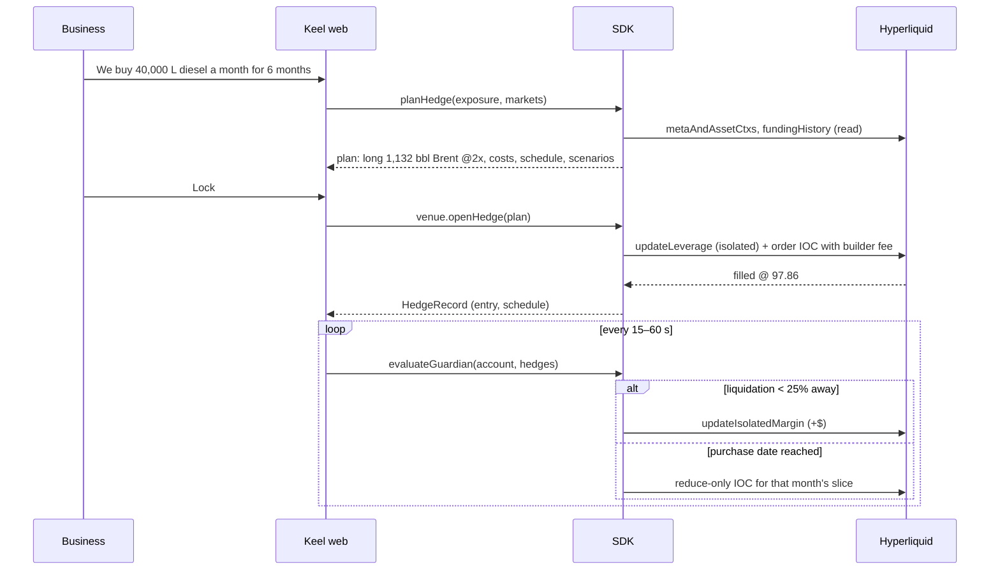

# Architecture

Keel is three thin layers around one engine:

| Layer | Responsibility |
|---|---|
| **`packages/sdk`** | Everything that matters: catalog, unit conversion, sizing, margin math, costs, schedules, scenarios, guardian decisions, execution venues, reports, risk assessment. |
| **`apps/web`** | UI and state: market board, hedge wizard, dashboard, simulation lab, watch mode. Runs the guardian while the tab is open. |
| **`apps/keeper`** | The same guardian on a server, 24/7, using the agent key and an exported hedge book. Also CLI tools (`plan`, `watch`). |

## Hedge lifecycle

## Trust model

Keel never takes custody.

| Actor | Can | Cannot |
|---|---|---|
| **User's wallet** | Everything. Signs three one-time approvals: unified account mode, the Keel agent, the builder fee cap. | — |
| **Keel agent key** (generated in the browser, stored locally; optionally given to the keeper) | Place and cancel orders, change leverage, add isolated margin — for this user only. | Withdraw, transfer, or send funds anywhere. Enforced by Hyperliquid, not by Keel. |
| **Keel (builder address)** | Receive the approved builder fee (0.03%) on orders Keel routes. | Charge more than the user approved; touch the user's account. |

Agent approvals expire after 170 days and can be revoked any time from Hyperliquid.

## Execution venues

`Venue` is a four-method interface (`getAccount`, `openHedge`, `reduce`, `addMargin`). Two implementations:

- **`LiveVenue`** — Hyperliquid through the agent key. Market mode sends IOC orders capped at 1% slippage; limit mode rests at the oracle price (used automatically when a book is thin, e.g. on testnet).
- **`PaperVenue`** — fills at live mid ± 2 bp, charges estimated fees, accrues funding hourly, applies liquidations. State lives in any key-value store (localStorage in the browser, memory in tests).

Because the guardian and reports only see the `Venue` interface, the demo, the tests and live trading exercise the same code paths.

## The hedge book

Hyperliquid keeps one net position per market; a business may hold several hedges on the same market (e.g. two depots buying diesel). Keel keeps a `HedgeRecord` per business hedge — entry, schedule, settlements, events — and reconciles the sum against the on-chain position every guardian run, alerting on drift (manual trades, liquidations).

## Failure handling

| Situation | Behaviour |
|---|---|
| Price moves against the hedge | Guardian tops up margin at 25% from liquidation, back to 40%. |
| No free collateral and < 10% from liquidation | Guardian cuts the hedge by 25% so the rest survives, and alerts. |
| Settlement slice below the $10 minimum order | Batched into the next settlement. |
| Position missing or different from the book | Critical/warning alert; nothing is traded blindly. |
| Cross-margined position | No isolated top-ups (they'd fail); alert to deposit instead. |
| Thin order book | Limit order at the oracle price; the record stays `pending` until the fill shows up. |
| Hyperliquid API error | Order returns `status: "error"` with the message; the record isn't created. |

## Tech

TypeScript end to end · Next.js 16 · Tailwind 4 · viem · `@nktkas/hyperliquid` · Vitest.
